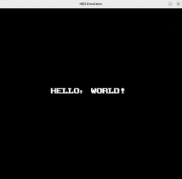
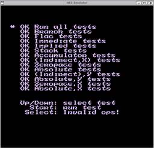
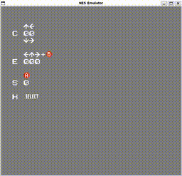
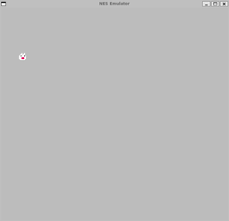
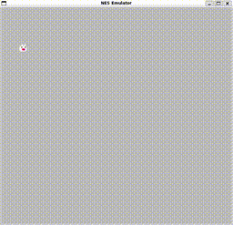
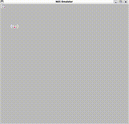
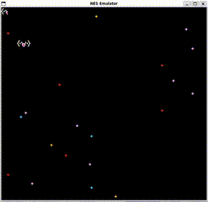
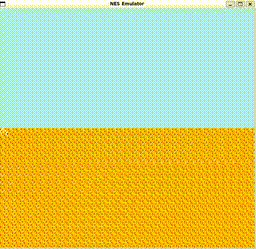

* NES Emulator
NESの自作エミュレーターです。

** 実行例
*** Super Mario Bros.
#+CAPTION: SMBデモ
[[file:image/smb_small.gif]]

** 動作環境
*** 環境
- Ubuntu 22.04.5 LTS
- C++ 20  

*** 使用ツール一覧
| 使用ツール | バージョン |
|---------+---------|
| cmake   |  3.22.1 |
| gcc     |  11.4.0 |
| SDL2    |  2.0.20 |

*** インストール方法
#+begin_example
sudo apt update
sudo apt install cmake libsdl2-dev
#+end_example

** 使用方法
*** ビルド
#+begin_example
cmake -S . -B build
cmake --build build
#+end_example

*** 実行
#+begin_example
./build/nes rom/<rom file>
#+end_example

** 現状未対応なもの
- 8x16のスプライト表示
- APU
- Mapper0以外

** テスト結果

| テスト名                       | パス                        | テスト内容                    | 結果                                              | 参考                                                                                                                              |
|-----------------------------+----------------------------+----------------------------+--------------------------------------------------+----------------------------------------------------------------------------------------------------------------------------------|
| hellowrold                  | rom/test/helloworld/       | BGの表示テスト                 |               | https://tekepen.com/nes/sample.html                                                                                              |
| nestest                     | rom/test/nestest/          | CPUの命令テスト                |                  | https://www.nesdev.org/wiki/Emulator_tests                                                                                       |
| color_test                  | rom/test/color_test/       | 色表示テスト                   |                          | https://forums.nesdev.org/viewtopic.php?p=155593#p155593                                                                         |
| ｷﾞｺ猫でもわかるファミコンプログラミング | rom/test/giko/giko005/     | スプライトの表示テスト            |                        | https://web.archive.org/web/20250621085001/http://gikofami.fc2web.com/index.html https://blog.naver.com/yagami81 (韓国語の転載サイト) |
|                             | rom/test/giko/giko008/     | コントローラーのテスト            |                        |                                                                                                                                  |
|                             | rom/test/giko/giko009/     | DMAによる2つのスプライトの移動テスト |                        |                                                                                                                                  |
|                             | rom/test/giko/giko011/     | 背景のスクロールテスト            |                        |                                                                                                                                  |
|                             | rom/test/giko/giko015/     | ラスタスクロールのテスト           |                        |                                                                                                                                  |
| sprite_hit_tests            | rom/test/sprite_hit_tests/ | Sprite0Hitの確認テスト         | 08.double_height以外 (8x16のスプライト表示が未対応のため) | https://forums.nesdev.org/viewtopic.php?t=626                                                                                    |

